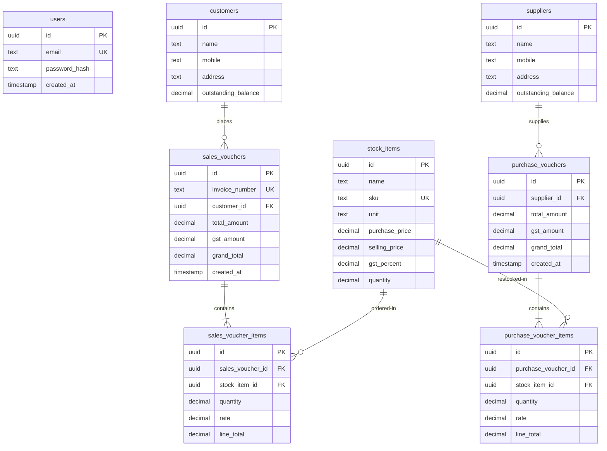

# SmartERP — Keyboard-Driven Bookkeeping & Inventory System 📊⌨️

SmartERP is an enterprise bookkeeping and inventory management web application. Heavily inspired by the workflow of **TallyPrime**, it is designed to be fully keyboard-driven to maximize speed for accountants, combining a sleek modern user interface with double-entry ledger tracking, real-time inventory management, auto-incrementing invoices, and high-fidelity PDF invoice exports.

---

## 🌟 Key Features

### 1. Keyboard-Friendly Navigation (Tally-Style)
Accounts can be managed almost entirely without using a mouse. 
* **Function Keys (F1-F10)**: Instantly jump between modules.
* **Quick Reference Sidebar (Ctrl+/)**: Access a collapsible list of all shortcut keys from any page.
* **Command Palette (Ctrl+K)**: Search and trigger pages or common actions.
* **Table Arrow-Key Navigation**: Focus tables, traverse rows using `ArrowUp`/`ArrowDown`, and open detail modals using `Enter` or edit modals using `Alt+E`.
* **Dynamic Modals**: Close overlays instantly using the `Esc` key.

### 2. Transaction Flow (Full Double-Entry Chain)
* **Sales Vouchers**:
  * Auto-generates sequential, zero-padded invoice numbers (`INV-000001`, `INV-000002`...) using a PostgreSQL sequence.
  * Decrements stock quantity in real-time.
  * Increases the selected customer's outstanding balance.
* **Purchase Vouchers**:
  * Logs inbound stock supplies.
  * Increments stock quantity in real-time.
  * Increases the selected supplier's outstanding balance.
* **Self-Healing PDF Export**: High-fidelity invoice PDF downloads on-the-fly.

### 3. Inventory & Master Ledgers
* **Customers & Suppliers**: Master registry with outstanding balance monitoring, mobile, and address fields.
* **Stock Catalog**: Tracks SKU, quantity, purchase price, selling price, and tax (GST %).
* **Smart Unit Validations**:
  * Enforces **integer-only quantity** constraints for count-based units (`PCS` and `BOX`).
  * Supports fractional decimal values (up to 2 decimal places) for continuous units (`KG` and `LTR`).

### 4. Hybrid Aesthetics
* A premium dark/light mode dashboard with key performance indicators (Total Sales, Total Purchases, Net Profit, and Low Stock Alerts).
* Accessible Light Mode styling with perfect color contrast.

---

## ⌨️ Keyboard Shortcuts Cheat Sheet

| Key Combo | Action / Route | Target Screen |
| :--- | :--- | :--- |
| **`F1`** | Navigate to Dashboard | Global |
| **`F2`** | Navigate to Customer Ledgers | Global |
| **`F3`** | Navigate to Supplier Ledgers | Global |
| **`F4`** | Navigate to Stock Items Catalog | Global |
| **`F5`** | Navigate to Sales Vouchers List | Global |
| **`F6`** | Add New Customer Ledger | Customer List |
| **`F7`** | Add New Supplier Ledger | Supplier List |
| **`F8`** | Create New Sales Voucher | Sales List |
| **`F9`** | Create New Purchase Entry | Purchase List |
| **`F10`** | Add New Stock Item | Stock Catalog |
| **`Ctrl + K`** | Open Search / Command Palette | Global |
| **`Ctrl + /`** | Toggle Shortcuts Reference Bar | Global |
| **`Alt + A`** | Add Row to Line Items | Voucher Forms |
| **`Alt + D`** | Submit Voucher / Create | Voucher Forms |
| **`Alt + P`** | Print / View PDF | Details Modals |
| **`Esc`** | Close current modal / palette | Global |

---

## 🗄️ Database Schema Details

The database is normalized to ensure data integrity and prevent redundancy:



### Invoice Number Sequence & Trigger
To prevent manual input errors and duplicates, `sales_vouchers` utilizes an auto-incrementing database sequence:
```sql
CREATE SEQUENCE IF NOT EXISTS sales_invoice_seq START WITH 1;

CREATE OR REPLACE FUNCTION generate_invoice_number() 
RETURNS trigger AS $$
BEGIN
    IF NEW.invoice_number IS NULL OR NEW.invoice_number = '' THEN
        NEW.invoice_number := 'INV-' || LPAD(nextval('sales_invoice_seq')::text, 6, '0');
    END IF;
    RETURN NEW;
END;
$$ LANGUAGE plpgsql;

CREATE OR REPLACE TRIGGER tr_generate_invoice_number
BEFORE INSERT ON sales_vouchers
FOR EACH ROW
EXECUTE FUNCTION generate_invoice_number();
```

---

## 🛠️ Tech Stack & Design Patterns

* **Framework**: [Next.js 16 (App Router)](https://nextjs.org/) + React 19
* **Database**: [Supabase (PostgreSQL)](https://supabase.com/)
* **Styles**: Tailwind CSS v4
* **PDF Utility**: [PDFKit](http://pdfkit.org/)
* **Self-Healing Fonts**: Incorporates an automated dynamic copying script inside `app/api/sales-vouchers/[id]/pdf/route.ts` that copies required Helvetica AFM font files to `C:\ROOT\node_modules` at runtime. This bypasses Next.js bundler isolation bugs which would otherwise result in `ENOENT` crashes.

---

## 🚀 Local Development Setup

### 1. Clone & Install Dependencies
Navigate to the project directory and install standard packages:
```bash
npm install
```

### 2. Configure Database Variables
Create a `.env.local` file inside the `smarterp` folder with the following Supabase credentials:
```env
SUPABASE_URL="https://your-project-id.supabase.co"
SUPABASE_SERVICE_ROLE_KEY="your-service-role-key-bypasses-rls"
JWT_SECRET="your-secure-shared-jwt-secret-key"
```

### 3. Run Database Schema Setup
Execute the contents of `schema.sql` inside your Supabase SQL Editor. This will provision all 8 tables, constraints, indices, and the automated trigger for sequential invoice generation.

### 4. Launch Development Server
```bash
npm run dev
```
Open **[http://localhost:3000](http://localhost:3000)** in your browser. 

*Credentials for testing (pre-configured in seed data):*
* **Email**: `testuser_e2e_1@smarterp.com`
* **Password**: `password123`
